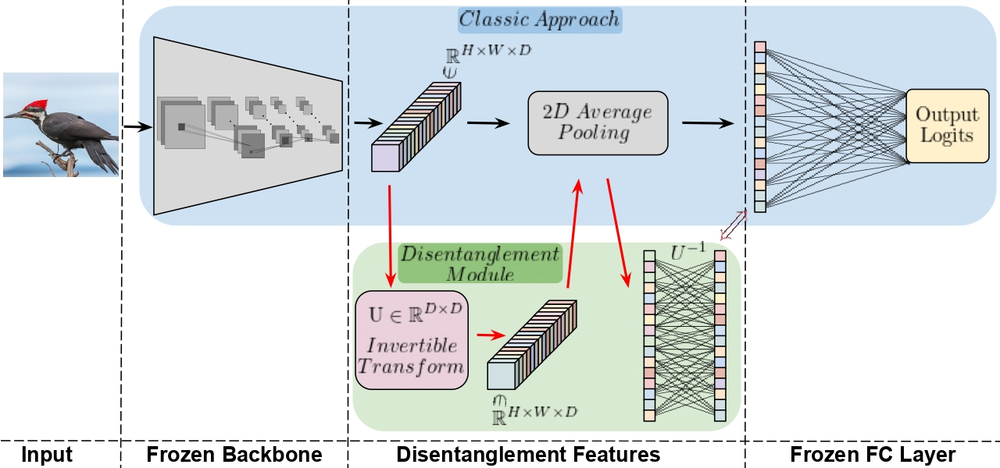

# EPIC: Explanation of Pretrained Image Classification Networks via Prototypes

Explainable AI (XAI) methods generally fall into two categories. Post-hoc approaches generate explanations for pre-trained models and are compatible with various neural network architectures. These methods often use feature importance visualizations, such as saliency maps, to indicate which input regions influenced the model’s prediction. Unfortunately, they typically offer a coarse understanding of the model’s decision-making process. In contrast, ante-hoc (inherently explainable) methods rely on specially designed model architectures trained from scratch. A notable subclass of these methods provides explanations through prototypes, representative patches extracted from the training data. However, prototype-based approaches have limitations: they require dedicated architectures, involve specialized training procedures, and perform well only on specific datasets. In this work, we propose EPIC (Explanation of Pretrained Image Classification), a novel approach that bridges the gap between these two paradigms.

Like post-hoc methods, EPIC operates on pre-trained models without architectural modifications. Simultaneously, it delivers intuitive, prototype-based explanations inspired by ante-hoc techniques. To the best of our knowledge, EPIC is the first post-hoc method capable of fully replicating the core explanatory power of inherently interpretable models. We evaluate EPIC on benchmark datasets commonly used in prototype-based explanations, such as CUB-200-2011 and Stanford Cars, alongside large-scale datasets like ImageNet, typically employed by post-hoc methods. EPIC uses prototypes to explain model decisions, providing a flexible and easy-to-understand tool for creating clear, high-quality explanations.



Code to be released soon.

# Installation

```sh
conda create -n epic python=3.11
conda activate epic
pip install torch torchvision --index-url https://download.pytorch.org/whl/cu126
pip install -r requirements.txt
```